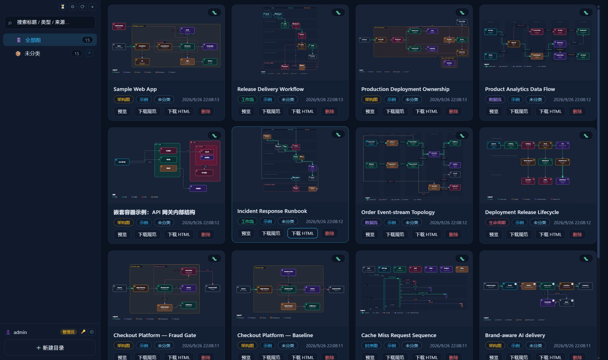
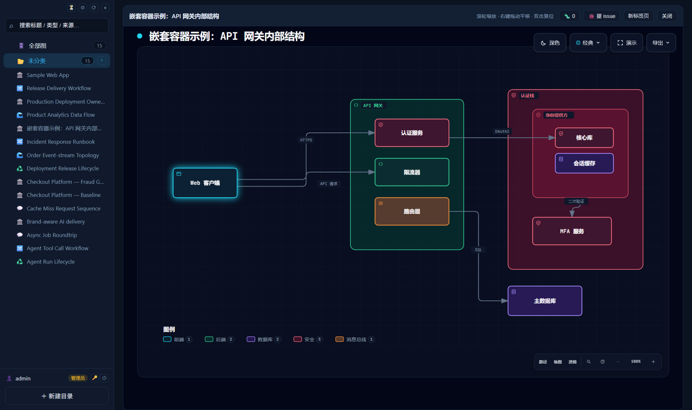
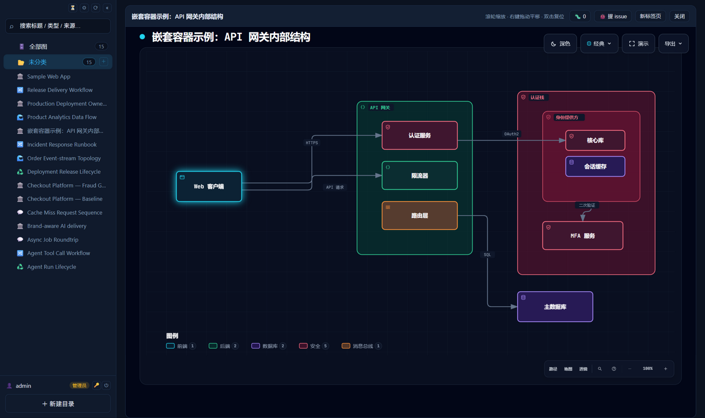
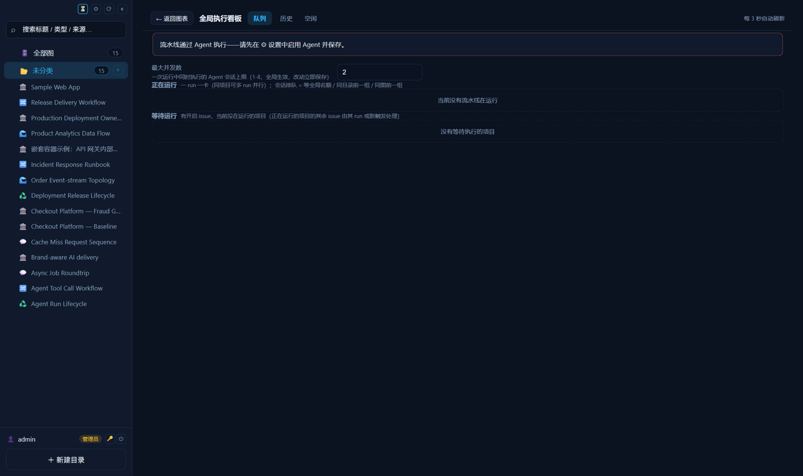
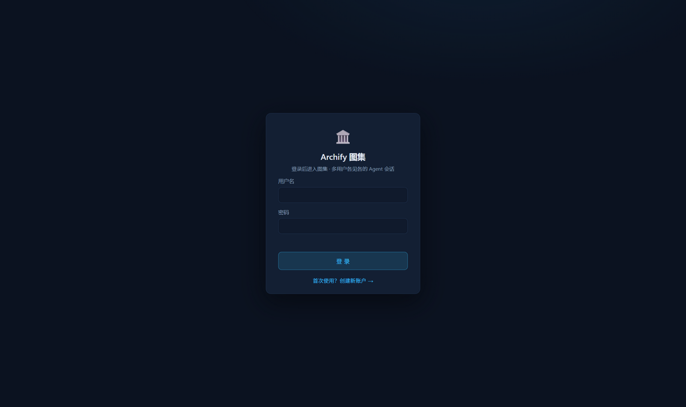

# Archify-Web 图集

**基于 [Archify](https://github.com/tt-a1i/archify) 渲染引擎的本地架构图集应用**：左侧项目目录树 + 右侧图表网格，支持快速导入（Archify JSON / Mermaid / 渲染 HTML / 一键导入示例）、悬停快速预览、整幅详情查看（滚轮缩放 / 右键平移），并内置 **Claude Code Agent 会话虚窗** 与 **Issue 流水线**——让 AI 读你的项目代码、自动产出并维护经过校验的架构图 / 工作流 / 时序图 / 数据流 / 生命周期图。

除 Agent 后端外**零运行依赖**（Node 内置模块直拼，包括 `node:sqlite`）；前端 vanilla JS 无构建；一条 `docker compose up` 即可部署。

| 图集主界面 | 整幅详情查看 |
|---|---|
|  |  |

| Agent 会话虚窗 | Issue 执行看板 · 登录门 |
|---|---|
|  |   |

## 功能一览

### 📊 图集（以项目目录组织）

- **左侧项目目录树**：多级目录（项目 → 模块 → …），目录可关联服务器上的**存放路径**——该目录下的图直接落盘到 `<存放路径>/graph/<id>/`，图与项目代码同处一个仓库
- **右侧缩略图网格**：自包含 SVG 缩略图、目录徽章、类型/来源标签；目录悬停弹出半透明快速预览浮层
- **整幅详情**：点图进入全幅查看，滚轮以光标为中心缩放、右键拖动平移、双击复位；连线悬停流光高亮
- **快速导入**：拖放 / 选择文件（`.json` 规范、`.html` 渲染产物）、粘贴 Archify JSON、粘贴 **Mermaid flowchart**（自动转换）、「一键导入示例」
- **质量把关**：所有导入先过 Archify 官方校验器（`validate --quality showcase --json`），**校验不过不入集**，诊断信息（错误码 + 证据 + 修正建议）原样展示
- **图集热更新（SSE）**：外部程序（agent / CI / 直接替换文件）更新图后网页自动刷新，无需 F5，多标签页天然同步
- **内容寻址去重**：图 ID = 规范内容哈希，重复导入原地刷新；更新图走 `replace` 换图（issue 自动迁移到新图）

### 🤖 Agent 虚窗（Claude Code Agent SDK）

- 全屏虚化蒙版 + **回复长廊**：历史回复按新旧距离透视排布，滚轮物理滑翔翻阅，最前卡可滚动阅读
- **多会话后台执行**：消息发出即返回，执行留在服务端跑——切会话、收起虚窗、关标签页都不中断；会话栏支持搜索 / 过滤 / 单条或批量导出 markdown（zip）
- **模型实时切换**、上下文芯片（当前目录 / 打开的图 / @引用图中组件）、工具执行细流
- **图集写保护**：会话 agent 不能直接创图 / 改图 / 删图——图的产生与修改只有「提 issue」一条通道，由 Issue 流水线统一落实

### 🐞 Issue 机制 + 自动执行流水线

- **缺陷/改进 issue**：挂在某张图的组件 / 连线 / 区域上（点图自动插入 `@标签`）
- **创建新图 issue**：目录级 new-feature，由流水线按 code-diagram 六阶段执行（init 项目 AGENTS.md → 需求解析 → **代码取证** → showcase 规范 → 校验 0 错 0 警告 → 导入 → 自动关闭）
- **统一执行**：同图多 issue 合并一个会话一次改图；多项目 run 并行 + **全局会话并发名额**；连续 2 组失败熔断；按客观证据（图被替换 / 目录新增图）自动关 issue
- **两级看板**：全局执行看板（运行中 / 等待 / 全局并发上限 / 历史）+ 项目级看板（待执行队列、立即执行/拒绝/重开、触发设置、历史）

### 👥 多用户登录

- 开放注册（注册需填个人 GLM API Key，**各用户会话各用各的 Key 计费**）；admin 账户首次启动自动种子
- 会话数据按用户隔离（admin 可见全部含流水线会话）；全局看板与流水线设置为 admin 专属
- 密码 scrypt 哈希 + HttpOnly Cookie 登录态，30 天滑动续期

## 快速开始

### 方式一：Docker（推荐）

```bash
git clone https://github.com/chl178/Archify-Web.git
cd Archify-Web
docker compose up -d --build
# → http://localhost:8766
```

- **数据持久化**：图集数据（manifest / 图目录 / issues.db / 用户表 / agent 设置与会话 / 流水线状态）存具名卷 `archify-gallery`，删容器重建不丢
- **项目代码接入**：compose 默认把主机 `./projects` 挂到容器 `/data`（`PROJECTS_DIR` 环境变量可改）。网页里新建顶层目录时用「选择路径…」浏览服务器磁盘，选中 `/data/<项目>` 作为存放路径——agent 代码取证与图落盘全在容器内闭环
- **端口**：`ARCHIFY_PORT=9000 docker compose up -d --build` 改主机端口
- **镜像（最小化多阶段构建，约 360MB）**：依赖层 `node:22-slim` 跑 `npm ci` 并裁掉非 x64-linux 的 ripgrep 二进制；运行层只有 `debian:bookworm-slim` + node 二进制（无 npm/git/ca-certificates，HTTPS 走 node 内置 CA）；agent 技能构建时装进镜像。**仅支持 x64-linux 宿主**
- 不用 compose：`docker build -t archify-web . && docker run -d -p 8766:8766 -v archify-gallery:/app/gallery -v "$PWD/projects:/data" archify-web`

**离线安装**：从 [Releases](../../releases) 下载 `archify-web_<版本>_image.tar.gz`：

```bash
docker load -i archify-web_v1.0.0_image.tar.gz
docker run -d -p 8766:8766 -v archify-gallery:/app/gallery -v "$PWD/projects:/data" archify-web:latest
```

### 方式二：裸机 Node

要求 **Node ≥ 22.5**（issues.db 用内置 `node:sqlite`）。

```bash
npm install              # 唯一运行依赖：@anthropic-ai/claude-agent-sdk（Agent 功能用）
node server.mjs          # http://127.0.0.1:8766
# PORT=9000 node server.mjs        自定义端口
# HOST=0.0.0.0 node server.mjs     监听全部网卡（局域网/反代）
```

不装依赖服务也能启动（图集功能完整），仅 Agent 功能不可用。

## 使用指南

### 1. 首次登录

- 打开网页出现登录门：首次可直接**创建账户**（用户名 1-30 字符 + 密码 6-128 字符 + 个人 GLM API Key）
- 内置管理员 `admin` / `adminadmin` 首次启动自动种子（**请立即在 🔑 账户设置里改密码**；改过密码不会被重置）
- 每个用户在 🔑 账户设置里维护自己的 GLM API Key——会话各用各的 Key 计费，服务器不设兜底 Key
- 全新部署首次启动会自动把 `archify/examples/` 的示例图批量校验+渲染入集（未分类），开箱即有图可看

### 2. 配置 Agent（⚙ 弹窗）

- **启用开关**打开 Agent 功能
- **API Base URL**：默认 `https://open.bigmodel.cn/api/anthropic`（智谱官方 Claude Code 适配网关），留空 = 官方 Anthropic 端点
- **模型列表**：逗号分隔自定义可选项；模型值为裸模型名（如 `glm-5.3`）

### 3. 建项目目录 + 绑定存放路径

1. 侧栏底部「＋ 新建目录」→ 填名称
2. 顶层项目可填**存放路径**：点「选择路径…」用内置的**服务器目录浏览器**选（本地部署 = 本机磁盘，容器部署 = 容器内 `/data`）
3. 该目录下的图落盘到 `<存放路径>/graph/<id>/`，删除图连目录一起删

### 4. 导入图

目录行悬停 ⇪ 按钮：一键导入示例 / 拖放文件 / 粘贴 Archify JSON / 粘贴 Mermaid flowchart。全部先过官方校验器，不过不入集。

### 5. 让 AI 出图 / 改图（issue 流水线）

- **新图**：目录行第一行最右的「＋」→ Issue 中心 → 提交「✨ 创建新图」issue（描述需求与范围），提交即驱动流水线
- **改图**：图详情头「🐞 提 issue」→ 点击图中组件/连线插入标签 → 提交缺陷/改进 issue
- 项目级看板（目录行悬停 ⚡）：待执行队列、▶ 立即执行、✕ 拒绝、历史；全局看板（侧栏 ⏳）：运行中会话分栏、全局并发上限、跨项目历史
- 也可以直接和 **Agent 虚窗**（Enter 唤醒）对话：它会帮你把需求打磨成 issue 再交给流水线

### 6. Agent 虚窗速记

- **Enter** 唤醒 / **ESC** 退出；空输入框再按 **Enter** 切 ⛶ 独占模式
- 滚轮先滚当前回复内容，到边界后翻长廊；↑/↓ 键跳转；左缘悬停唤出历史会话栏
- 流水线会话（🤖 徽标）只读回放

## 开发

### 目录结构

```
server.mjs            HTTP 服务（除 agent 后端外零依赖）：静态资源缓存/压缩 + 图集 API + archify 校验渲染管线 + SSE 热更新
auth.mjs              多用户登录（零依赖）：scrypt 密码哈希 + 令牌会话 + 个人 GLM API Key
claude.mjs            Agent 后端（Claude Code Agent SDK）：每消息一次 query()、会话注册表、SSE 事件总线、markdown/zip 导出
cicd.mjs              Issue 统一执行流水线：分组并发、全局会话名额、认领互斥、证据结算、熔断
mermaid-import.mjs    Mermaid flowchart → workflow v2 转换器（纯函数）
public/               前端（index.html / style.css / app.js，vanilla JS，无构建）
archify/              改造版 archify 渲染引擎（MIT，新增嵌套组件能力；自带测试）
.agents/skills/       项目级技能（code-diagram：代码取证出图六阶段）
docs/images/          README 截图
Dockerfile            多阶段最小化镜像（debian-slim + node 二进制，约 360MB，仅 x64-linux）
docker-compose.yml    一键部署：具名卷 archify-gallery + 主机项目挂 /data
```

### 本地开发

```bash
npm install
node server.mjs              # 改 server.mjs/claude.mjs 等后端文件需重启；public/ 静态文件刷新浏览器即生效
```

图集数据写到 `./gallery/`（git 忽略——内含用户表与会话，**绝不能入库**）。

### archify 测试

```bash
cd archify && node --test test/*.test.mjs
```

golden / cli / offline / xml 部分测试要求 monorepo 布局（引用 `../examples`、`.git`），独立安装下失败属环境问题而非回归——判定回归用基线对比法：同一命令在原版 archify 上跑一遍对比失败集合。

### 构建镜像

```bash
docker compose up -d --build
```

注意：**新增后端源文件要同步改 Dockerfile 的 `COPY server.mjs claude.mjs …` 行**（显式列举，不是整仓拷贝）。`.dockerignore` 排除 gallery/备份/测试/截图/遗留数据。

### 架构要点（改代码前值得知道的）

- **图 ID = 内容哈希**（`d-` 规范 / `h-` HTML），重复导入原地刷新；**更新已有图必须 `POST /api/import` 带 `replace:"旧图id"`**，否则新旧两张卡并存（issue 会自动迁移到新图）
- **写保护**：图集写 API 只放行浏览器来源或流水线运行凭证（`x-archify-ci-key`），程序化 curl 一律 403——会话 agent 想改图只能提 issue；`ARCHIFY_WRITE_KEY` 环境变量 + 同值请求头是手工调试逃生口
- **性能设计**：静态资源内存缓存 + brotli/gzip 预压缩、`?v=` URL immutable 长缓存、大 JSON API 带 ETag、issues.db 开 WAL + 预编译语句、导入管线与图集扫描全异步 IO、前端网格增量渲染 + 事件委托
- **SSE 热更新**：fs.watch 快路径（150ms 去抖）+ 2.5s 轮询兜底（manifest + 每图目录 size/mtime 指纹），API 变更即时广播
- **SDK 集成的坑**：`env` 选项整体替换进程环境（必须展开合并）；容器 root 下必须注入 `IS_SANDBOX=1` 否则 CLI 拒跑 bypassPermissions；CLI 异常退出会向进程组广播 SIGTERM（服务端有防护，别拆）；模型名必须裸名（不带 `provider/` 前缀）

## HTTP API（节选）

| 方法 | 路径 | 说明 |
|---|---|---|
| POST | `/api/auth/login` / `register` / `logout` | 登录 / 注册（需个人 GLM Key）/ 登出 |
| GET | `/api/diagrams` | 图集清单（folders + folderMeta + diagrams，带 ETag） |
| GET | `/api/events` | 图集热更新 SSE（gallery-update 事件） |
| GET | `/api/fs/list?path=` | 服务器侧目录浏览器（网页选存放路径用） |
| POST | `/api/folders` | 建目录（可带 localPath 关联存放路径） |
| POST | `/api/import` 🔒 | 导入图（`replace` = 换图 + issue 迁移） |
| GET/POST/PATCH/DELETE | `/api/issues…` | issue CRUD（创建类 `kind:"new-feature"` 提交即驱动流水线） |
| POST | `/api/agent/message` | 发消息给会话 agent（异步 202，后台执行） |
| GET | `/api/cicd` / `POST /api/cicd/run` 👑 | 流水线总览（普通用户剥离执行细节）/ 手动触发（admin） |

🔒 = 图集写保护（浏览器来源或 CI 凭证放行）；👑 = 仅 admin。完整路由见 `server.mjs`。

## 致谢

本项目的核心能力建立在以下开源项目之上，衷心致谢：

- **[Archify](https://github.com/tt-a1i/archify)**（MIT © tt-a1i / Cocoon AI）——图表校验与渲染引擎。本仓库 `archify/` 目录是其改造版：在保持原版渲染逐字节兼容（golden 级）的前提下新增了**嵌套组件**（递归 `children`、父子几何自动解算、连线穿越容器框）能力。原版 MIT 许可与第三方声明完整保留在 [`archify/LICENSE`](archify/LICENSE) 与 [`archify/THIRD_PARTY_NOTICES.md`](archify/THIRD_PARTY_NOTICES.md)
  - 间接致谢（经 Archify 内嵌）：[Simple Icons](https://github.com/simple-icons/simple-icons)（CC0，品牌图标矢量数据）、[JetBrains Mono](https://github.com/JetBrains/JetBrainsMono)（OFL 1.1，viewer 内嵌字体）
- **[@anthropic-ai/claude-agent-sdk](https://github.com/anthropics/claude-agent-sdk-typescript)**（MIT © Anthropic）——Agent 后端的全部能力来源：每条消息一次进程内 `query()`，多会话并发、无人值守执行、工具细流事件
- **[Node.js](https://nodejs.org)**——除 SDK 外零依赖的关键：`node:sqlite`（issues.db）、`node:http`、内置 zlib（brotli/gzip 预压缩）、内置 CA（容器镜像无需 ca-certificates）
- **[debian:bookworm-slim](https://hub.docker.com/_/debian)** / **[node:22-slim](https://hub.docker.com/_/node)**——最小化容器镜像的基础

前端刻意保持 vanilla JS 无构建无框架，所以没有前端框架可致谢——这本身就是设计选择。

## License

[MIT](LICENSE) © chl178。`archify/` 目录沿用其自身的 MIT 许可与第三方声明。
